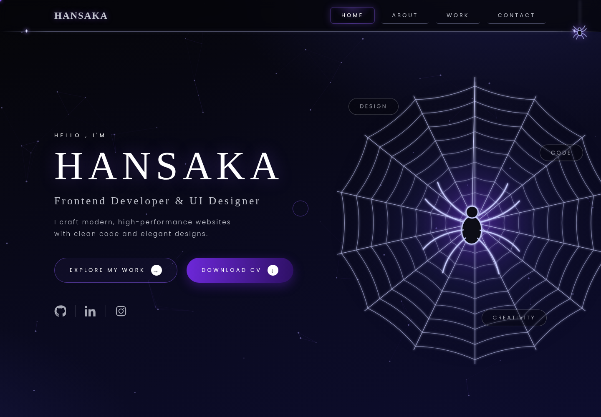

<div align="center">

# 🕷️ Hansaka Bandara — Portfolio

**Frontend Developer & UI/UX Designer** · CS Undergraduate @ IIT

Designed in Figma · Woven in code

[](https://hansaka-co.github.io/portfolio/)
[](#)
[](#)
[](#)
[](#)



</div>

---

## 🕸️ About

My personal portfolio — a spider-web themed dark site built entirely with
**vanilla HTML, CSS and JavaScript**. No frameworks, no libraries, no build step.
Every animation is hand-coded.

> *Like threads in a web, each project connects design, logic, and code.*

## ✨ Features

| | Feature |
|---|---|
| 🕸️ | **Self-drawing hero web** — every thread animates in, then the spider drops down on its silk |
| ⏳ | **Web-spinner preloader** with pulsing wordmark |
| 🔤 | **Letter-by-letter name reveal** with 3D flip entrance |
| ✨ | **Interactive particle web** background — threads connect to the visitor's cursor |
| 🕷️ | **Scroll-progress spider** that crawls down a thread as you read |
| 🎴 | **3D tilt** project cards + pulsing glow on the featured hexagon |
| 🧲 | **Magnetic buttons** with shimmer sweep & a glowing custom cursor |
| 📱 | Fully responsive · keyboard-focus visible · respects `prefers-reduced-motion` |

## 🛠️ Built With

- **HTML5** — semantic, accessible markup
- **CSS3** — custom properties, clip-path hexagons, keyframe animations
- **Vanilla JavaScript** — SVG web generation, Canvas particle system, IntersectionObserver reveals
- **Figma** — full UI design before a single line of code

## 📁 Structure

```
portfolio/
├── index.html          # single-page site: Home · About · Work · Contact
├── css/style.css       # design system + animations
├── js/main.js          # web generator, particles, interactions
└── assets/             # photo, CV, icons, favicon
```

## 📬 Contact

📧 hansakarbandara@gmail.com ·
💼 [LinkedIn](https://www.linkedin.com/in/hansaka-bandara) ·
🐙 [GitHub](https://github.com/Hansaka-co)

---

<div align="center">

*Open to UI/UX & Frontend internship opportunities — get caught in my web.* 🕸️

© 2026 Hansaka Bandara

</div>

